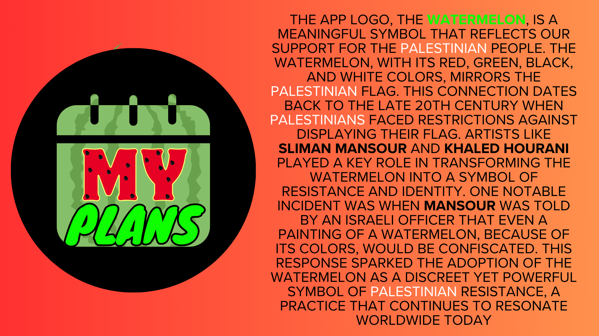
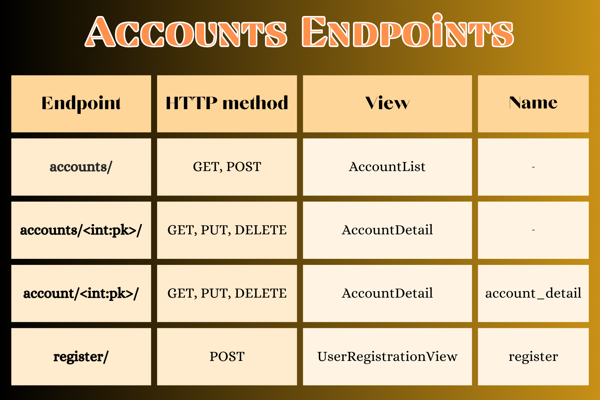
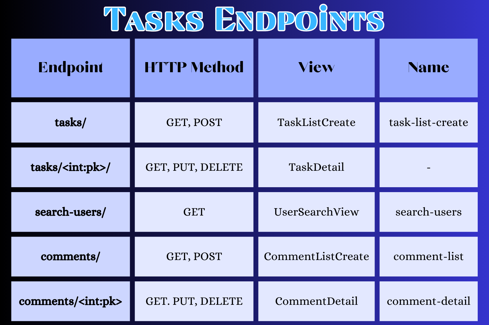

#  My Plans - Calender Application
## Overview
This is a calender application, that allows you to signup and create tasks, to keep your days organized, and to make sure your not forgetting to buy a birthday gift for a loved one. You can also permit other user to be able to see see and comment your tasks. 

## Logo 
I choose to create the logo for the app, while knowing that 1 child dies every 10 minutes in Gaza, by Israeli bombardment. The watermelon in the logo symbolizes the stand of solidarity with the palestinian people.  

### If you want to know all about why the watermelon became the symbol of the palestinian resistance, your can read about it in [THIS](https://www.businessinsider.com/why-watermelon-symbol-of-palestinian-resistance-2023-11?op=1) article.   

## Credits:
Businessinsider   

## Backend (Django REST Framework API)
## Back-end Overview
This API is part of a calender application. It allows users register, login, logout, update/delete account, create tasks, organize tasks by filter, search for users, give other users permission to read and comment tasks.    

## Feautures
- **Accounts Managment**: Users can *register*, and manage their accounts.
- **Tasks Managment**: Users can *create, update, view* and *delete* tasks. Tasks have *duedates*, *priorities*, *categories*, for better organisation.   

## Technologies
- Django REST Framework
- Python
- SQLite (for development)
- PostgreSQL (ElephantSQL for production)   

## Setup and Installation
Run the commands as instructed below, to setup and install the app and it's requirements in a new workspace.  

### Commands: 
**1. Clone the repository:**  
&nbsp; `git clone https://github.com/SoroushGReza/my-plans.git`   
**2. Navigate to the project directory:**  
&nbsp; `cd my-plans`   
**3. Install dependencies:**  
&nbsp; `pip3 install -r requirements.txt`   
**4. Run migrations:**  
&nbsp;  `python3 manage.py migrate`   
**5. Start the server:**  
&nbsp; `python3 manage.py runserver`   

## API Endpoints

  

# REMEMBER TO COMPRESS IMAGES LATER
  

## Tests

### TDD Tests

