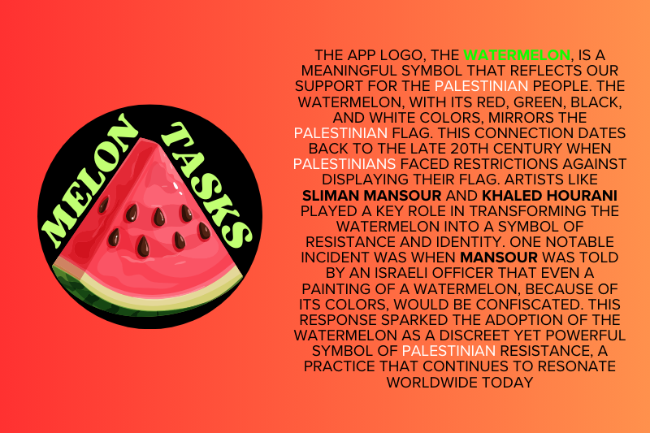

#  My Plans - Calender Application
## Overview
This is a calender application, that allows you to signup and create tasks, to keep your days organized, and to make sure your not forgetting to buy a birthday gift for a loved one. You can also permit other user to be able to see see and comment your tasks. 

## Logo 
I chose to create the logo for the app, while knowing that 1 child dies every 10 minutes in Gaza, by Israeli bombardment. The watermelon in the logo symbolizes the stand of solidarity with the palestinian people.  

If you want to know all about why the watermelon became the symbol of the palestinian resistance, your can read about it in [THIS](https://www.businessinsider.com/why-watermelon-symbol-of-palestinian-resistance-2023-11?op=1) article.   

## Credits:
Businessinsider   

## Backend (Django REST Framework API)
## Back-end Overview
This API is part of a calender application. It allows users register, login, logout, update/delete account, create tasks, edit and delete tasks, organize tasks by filter, search for users, and choose if created tasks are public or private.    

## Feautures
- **Registration**: Users can *sign up* and an account is than per automaic created for them. 
- **Sign In**: User can *sign in* to the accounts.
- **Sign out**: User can *sign out* from the account.  
- **Tasks Managment**: Users can *create, update, view* and *delete* tasks. Tasks have *duedates*, *priorities*, *categories*, *image field* (to upload images for tasks), *is_public* (to choose if a task should be buplic or private).   

## Technologies
- Django REST Framework
- Python
- SQLite (for development)
- PostgreSQL (ElephantSQL for production)   

## Setup and Installation
Run the commands as instructed below, to setup and install the app and it's requirements in a new workspace.  

### Commands: 
**1. Clone the repository:**  
&nbsp; `git clone https://github.com/SoroushGReza/my-plans.git`   
**2. Navigate to the project directory:**  
&nbsp; `cd my-plans`   
**3. Install dependencies:**  
&nbsp; `pip3 install -r requirements.txt`   
**4. Run migrations:**  
&nbsp;  `python3 manage.py migrate`   
**5. Start the server:**  
&nbsp; `python3 manage.py runserver`   

## API Endpoints

  

  

# Tests

## Back-End Testing Overview
I conducted testing on the backend to ensure its reliability and functionality. The backend, built with Django REST Framework, consists of various components such as models, views, and serializers, each playing a role in the application's overall performance. The testing strategy was primarily focused on validating these components to guarantee a robust and error-free application.  

## Test Execution
I implemented both Test-Driven Development (TDD) and tests written after implementation. The tests were designed to cover a range of scenarios, including creating, retrieving, updating, and deleting data in the database.  

## Test Suites
Two primary tests were created:  

**Task API Tests**: This tests the functionality related to tasks. Key tests include:  

- Verify that tasks can be listed by logged in users.
- Ensure that logged in users can create tasks with specific attributes.
- Confirm that users who are not logged in cannot create tasks.   

**Account Tests**: This is tests for account management. It includes: 

- **Model tests** to ensure proper account creation.
- **View tests** to verify account details retrival, edit, and deletion.
- **Serializer tests** to check the correct serialization of account data.  

## Run tests:  

In the terminal from the root directory run this command: 
&nbsp; `python3 manage.py tests`  

## Test Results
The majority of tests successfully passed, demonstrating application robustness and effectiveness of the implemented features. However, during the final rounds of testing, some tests failed due to unexpected issues.   

### Here is a brief overview of these failures:  

- **Task Listing Test**: An AttributeError occurred, indicating an issue with how the response data was being handled.
- **Task Creation Test for Logged-In Users**: This test failed with an *AssertionError*, suggesting a mismatch in expected HTTP status code.
**Task Creation Test for None-Logged-In Users**: This test also failed due to an *AssertionError* related to HTTP status code.  

## Addressing Test Failures
Due to time constraints, I was unable to resolve these last few test failures. However, note that these tests had passed in earlier stages of development. The failures are likely due to recent changes in the codebase or environment configurations, which could not be addressed, due to submission deadline.

## Conclusion
Despite the challenges faced towards the end of the testing phase, the backend of the application has demonstrated reliability and functionality through testing. The enccountered issues provide valuable insight for future improvement. 

