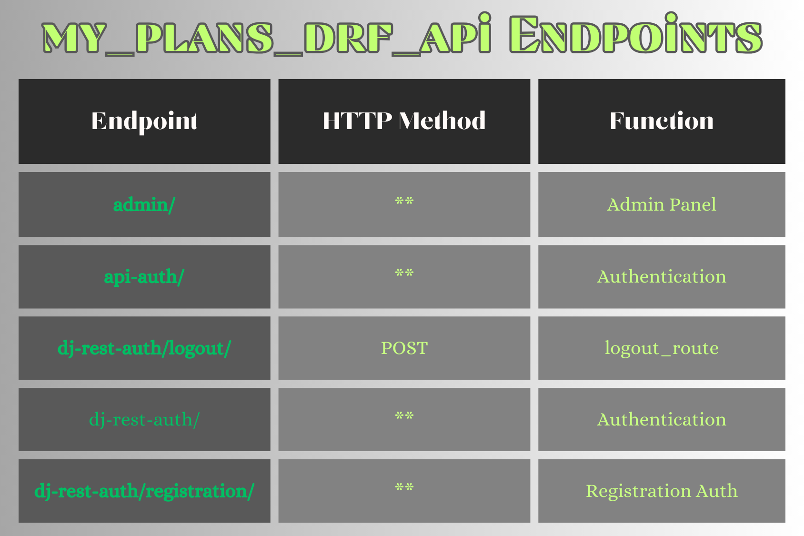
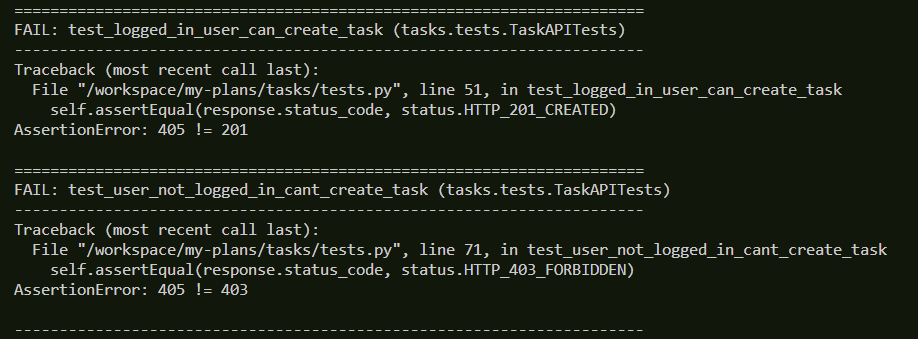
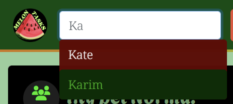

#  Melon Tasks

## Table of contents

> 1. [Overview](#overview)
> 2. [Logo](#logo)
> 3. [Setup and Installation](#setup-and-installation)
> 4. [Agile Development & User Stories](#agile-development--user-stories)
> 5. [Backend (Django REST Framework API)](#backend-django-rest-framework-api)
> 6. [Tests (Backend)](#back-end-testing-overview)
> 7. [Frontend (React)](#frontend-react)
> 8. [Custom React Components](#custom-react-components)
> 9. [UI/UX Design & Features](#uiux-design--features)
> 10. [Tests (Frontend)](#frontend-testing-overview)
> 11. [Deployment](#deployment)

## Overview
This is a social calender application, that allows you to signup and create tasks, while being able to post tasks that are public that you can share with others. Users can comment their own or other users public tasks as well. Keep your days organized, while being social allows you to distance yourself from feeling bored while you go through your daily routine.

## Logo

  

# Setup and Installation
Run the commands as instructed below, to setup and install the app and all required packages in a new workspace.  

### Commands:
**1. Clone the repository:**  
&nbsp; `git clone https://github.com/SoroushGReza/melon-tasks.git`   
**2. Navigate to the project directory:**  
&nbsp; `cd my-plans`   
**3. Install dependencies:**  (**Backend**) 
&nbsp; `pip3 install -r requirements.txt`  
 
**4. Run migrations:**  
&nbsp;  `python3 manage.py makemigrations` followed by 
&nbsp;  `python3 manage.py migrate`  

**5. Install packages (Frontend):** 
&nbsp; 1. `cd frontend` to navigate to the frontend folder. 
&nbsp; 2. `npm install` to install all packages. 

**5. Start the server:**  
&nbsp; `python3 manage.py runserver`   

# Agile Development & User Stories
I built this application using Agile methodology. To keep track of all the user stories I used GitHub Projects.  

Below is links to the full project containing all the user stories in GitHub.
- [*Board-view*](https://github.com/users/SoroushGReza/projects/12/views/1?layout=board)  
- [*Table-view*](https://github.com/users/SoroushGReza/projects/12/views/1)   

### Below is all the user stories of this project, to see the tasks for each user story, use the "**Tasks**" links. 

## Back-end user stories:

&#9745; As a **User**, I want to **have a personal account** so that I can **manage my tasks and personal information**. [**Tasks**](https://github.com/users/SoroushGReza/projects/12/views/1?layout=board&pane=issue&itemId=46607629)  

&#9745; As a **User**, I want to **create and manage my tasks**. [**Tasks**](https://github.com/users/SoroushGReza/projects/12/views/1?layout=board&pane=issue&itemId=46608603)  

&#9745; As a **User**, I want to be able to **Categorize and Prioritize my tasks** for **better organization**. [**Tasks**](https://github.com/users/SoroushGReza/projects/12/views/1?layout=board&pane=issue&itemId=46608888)  

&#9745; As a **User**, I want to **filter tasks** based on **different criteria like date, category etc.**. [**Tasks**](https://github.com/users/SoroushGReza/projects/12/views/1?layout=board&pane=issue&itemId=46609157)  

&#9745; As a **developer**, I want to **ensure that the application is robust and error-free.** [**Tasks**](https://github.com/users/SoroushGReza/projects/12/views/1?layout=board&pane=issue&itemId=46613499)   

## Front-end user stories:

&#9745; As a **User**, I want a **user friendly and responsive interface** to **manage my tasks**. [**Tasks**](https://github.com/users/SoroushGReza/projects/12/views/1?layout=board&pane=issue&itemId=46611968)  

&#9745; As a **User** I want to be able to **see the calender with my tasks on the homepage when logged in** so that I can **navigate to existing tasks to edit/delete them, or add new tasks**.
 [**Tasks**](https://github.com/users/SoroushGReza/projects/12/views/1?layout=board&pane=issue&itemId=46612247)  

&#9745; As a **User** I can **navigate to all pages using a navbar** so that I can **easily access everything in the application** [**Tasks**](https://github.com/users/SoroushGReza/projects/12/views/1?layout=board&pane=issue&itemId=46999304)  

&#9745; As a **User** I can **scroll through all tasks/comments that are loaded** so that I can **see all my tasks/comments in the same page**. [**Tasks**](https://github.com/users/SoroushGReza/projects/12/views/1?layout=board&pane=issue&itemId=48835879)  

&#9745; As a **User**, I want to be able to **manage my account** so that I can **update my personal information, and delete my account**. [**Tasks**](https://github.com/users/SoroushGReza/projects/12/views/1?layout=board&pane=issue&itemId=49172369)  

&#9745; As a **User**, I want to be able to **comment on tasks that is public** so that I can **share my thoughts with others**. [**Tasks**](https://github.com/users/SoroushGReza/projects/12/views/1?layout=board&pane=issue&itemId=49172684)  

&#9745; As a **developer**, I want to **ensure that the application is robust and error-free**. [**Tasks**](https://github.com/users/SoroushGReza/projects/12/views/1?layout=board&pane=issue&itemId=46613499)   

## Future improvements user stories:

&#9744; As a **Developer** I want to **make improvements for the application** so that **it is more user friendly** [**Tasks**](https://github.com/users/SoroushGReza/projects/12/views/1?layout=board&pane=issue&itemId=49267934)

**User Stories**:

&#9744; **Calendar-view**: dropdown, to choose month/year view for the calendar  
&#9744; Functionality to **permit** single/several users to **view/comment** tasks that is non-public.  
&#9744; **Start-time & end-time**: Add start and end time fields for tasks. 
&#9744; **Notifications**: Get notifications for tasks 1 day before due date.  
&#9744; **Confirmation email** sent to signed up users, with **confirmation link**.  

&#9744; **Task-view**: to show tasks in different layouts. (**3 layouts**)  
- Layout 1: **Preview-view**, full tasks are shown in TasksPage. **(Current)**
- Layout 2: **List-view**, tasks shown as a list without images and full content.
- Layout 3: **Board-view**, tasks shown as smaller previews, with 4 tasks in each row.

&#9744; **Color themes**: possibility to change application color themes  
- Dark
- Light
- Watermelon (**Current**)
- Reversed watermelon 

## General user stories:

&#9745; As a **developer**, I want to **deploy the application for public access** and **make sure that everything is documented**. [**Tasks**](https://github.com/users/SoroushGReza/projects/12/views/1?layout=board&pane=issue&itemId=46613677)   

# Backend (Django REST Framework API)
## Back-end Overview
This API is part of a calender application. It allows users register, login, logout, update/delete account, create tasks, edit and delete tasks, organize tasks by filter, search for users, and choose if created tasks are public or private.    

## Features
- **Registration**: Users can *sign up* and an account is than per automaic created for them. 

- **Sign In**: User can *sign in* to the accounts.
- **Sign out**: User can *sign out* from the account.
- **Tasks Managment**: Users can *create, update, view* and *delete* tasks. Tasks have *duedates*, *priorities*, *categories*, *image field* (to upload images for tasks), *is_public* (to choose if a task should be buplic or private).   

## Technologies
- Django REST Framework
- Python
- SQLite (for development)
- PostgreSQL (ElephantSQL for production)   

## API Endpoints

  

# Tests

## Back-End Testing Overview
I conducted testing on the backend to ensure its reliability and functionality. The backend, built with Django REST Framework, consists of various components such as models, views, and serializers, each playing a role in the application's overall performance. The testing strategy was primarily focused on validating these components to guarantee a robust and error-free application.  

## Test Execution
I implemented both Test-Driven Development (TDD) and tests written after implementation. The tests were designed to cover a range of scenarios, including creating, retrieving, updating, and deleting data in the database.  

## Test Suites
Two primary tests were created:  

**Task API Tests**: This tests the functionality related to tasks. Key tests include:  

- Verify that tasks can be listed by logged in users.
- Ensure that logged in users can create tasks with specific attributes.
- Confirm that users who are not logged in cannot create tasks.   

**Account Tests**: This is tests for account management. It includes: 

- **Model tests** to ensure proper account creation.
- **View tests** to verify account details retrival, edit, and deletion.
- **Serializer tests** to check the correct serialization of account data.  

## Run tests: 

### First, configure the backends settings for the Django REST Framework API before running the tests.  
Then in the terminal, from the root directory, run this command:  
&nbsp; `python3 manage.py tests`  

## Test Results
The majority of tests successfully passed, demonstrating application robustness and effectiveness of the implemented features. However, during the final rounds of testing, two tests failed.

### Here is a brief overview of these failures:  

- **Task Creation Test for Logged-In Users**: This test failed with an *AssertionError*, suggesting a mismatch in expected HTTP status code.
- **Task Creation Test for None-Logged-In Users**: This test also failed due to an *AssertionError* related to HTTP status code. 

## Addressing Test Failures
Due to time constraints, I was unable to resolve these last few test failures. However, note that these tests had passed in earlier stages of development. The failures are likely due to recent changes in the codebase or environment configurations, which could not be addressed before the submission deadline. 

## Conclusion
Despite the challenges faced towards the end of the testing phase, the backend of the application has demonstrated reliability and functionality through testing. The enccountered issues provide valuable insight for future improvement.   
 

# Frontend (React)
## Frontend Overview
This front-end is built using React, to give the application an interactive user experience.  

It provides the following functionality:  
- **Sign up** - Users can register to create an personal account. 
- **Sign in** - Users can than *sign in* after registration.  
- **Sign out** - Users can *sign out* by using the "**Sign out**" link in the navbar. 
- **Account managment** - Users can manage their personal account, by being able to update user data such as *account image* (Avatar), *bio*, *username*, *password* and to *delete* the account.  
- **Task creation** - Users can create tasks, that will show in the *calendar* (Home page) when logged in.  

There is a various number of fields to choose from when creating a task, however only three of them is required *title*, *content* and *due date*.

Rest of the fields *priority*, *category*, *status*, *overdue*, *public* (is set to non-public per default) and *imagefield* (to upload images) for the task created. 

- **Search** - Users can search other user accounts and navigate to the account and see the users public tasks.  
- **Commenting** - Users can comment on other users public tasks.
- **Comment managment** - Users can manage their comments, by being able to *edit* and *delete* posted comments that they own.  

- **Task managment** - Users can manage the created tasks, by being able to *edit* and *delete* tasks.   

## User Feedback / Error handling:

This application gives user feedback by *Alert* messages.  

I would like to add more *alerts* to enhance the user experience, but due to the complexity of the project, and the timestamp to submission deadline, I had to prioritize.  

However for future improvements of this application, adding more user feedback, and error handling should be implemented, such as **verifying** when tasks are *created*, *edited*, *deleted*, and the same goes for the account managment, such as *registration*, acoount *deletion* and when *updating* user data.   

## React Architecture
In the development of "Melon tasks", I used React (version 17.0.2), JavaScript library for building user interfaces. The application architecture is built by modular and reusable components.

### Key React dependencies and libraries used include:

- **React Full Calandar**: Interactive calendar.
- **React-bootstrap and bootstrap**: Used for styling and responsive design.
- **Axios**: Used for making HTTP requests to the back-end.
- **React Router Dom**: Enabled navigation within the application.
- **JWT Decode**: Assisted in decoding JWT's for authentication.
- **React Datepicker**: For a better user interface with an interactive date picker.   

These dependencies highlight the focus on creating a user-friendly and interactive application, with emphasis on functionality and aesthetics.   

# Custom React Components
This is the custom React components for this application. Each component is designed to enhance user experience.

## NavBar Component

### [NavBar.js](https://github.com/SoroushGReza/melon-tasks/blob/main/frontend/src/components/NavBar.js)
The **NavBar** component is the primary navigation bar of the application. It includes features like a dynamic *search bar*, navigation links that change based on the user's authentication status. The component uses *react-bootstrap* for UI, *axios* for API requests, and custom hooks for managing click events outside the component.  

### Use in this application:

#### For logged out users:
 
For the users that is not authenticated, the **NavBar** shows the following links:
- **Home**: This page shows a calendar with a monthly view.
- **Sign in**: Where the user can sign in to their personal account.
- **Sign up**: Users can create a personal account by signing up.  

#### For logged in users:
 
For user that are logged in, the **NavBar** shows the following links:
- **Create task**: Where users get directed to the **TaskCreateForm** page to create tasks.
- **Home**: Shows the same calendar as for the logged out users, but includes the user tasks in the calendar.
- **Tasks**: navigates to the users **TasksPage**, where all the tasks created by the logged in user is previewed.
- **Sign out**: Signs out the user, and the user is getting navigated to the *sign in* page.
- **Account**: This page shows the user **Account** data, and includes the user tasks that are puclic for other users to se.  

## Asset Component
### [Asset.js](https://github.com/SoroushGReza/melon-tasks/blob/main/frontend/src/components/Asset.js)
The **Asset** component is a flexible component used to display different types of content, such as a loading *spinner*, *image*, or a *message*. It accepts props for *spinner*, *src*, and *message*. When the spinner prop is true, it displays a loading animation. If the src prop is provided, it renders an image with the source URL. The message prop, when present, shows a text message. This component is styled using CSS modules.

### Use in this application:
 
- **Primary use**: This component is used primarily as a **Spinner** animation that shows when a page and data is loading.  
- **Secondary use**: for showing a small *image* and a *message* (e.g to upload images, or to show when users doesn't have public tasks in their account page) and also to show the application **Logo** in the NavBar.  

##  Avatar component

### [Avatar.js](https://github.com/SoroushGReza/melon-tasks/blob/main/frontend/src/components/Avatar.js)
The **Avatar** component displays a user avatar image. It takes *src* for the image source, an optional *height* to set the image size (default 45px), and text to display with the avatar. 

### Use in this application:
 
- This component is used where user identification is required, like in the **NavBar** as *logged in* and the users **Account** page.

## MoreDropdown Components

### [MoreDropdown.js](https://github.com/SoroushGReza/melon-tasks/blob/main/frontend/src/components/MoreDropdown.js)
This component includes two dropdowns: **AccountEditDropdown** and **MoreDropdown**.

### About each dropdown, and where they are used:
 

**AccountEditDropdown**: Used for managing user account settings. It uses React Router *useHistory* hook for navigation and *react-bootstrap* for UI components. This dropdown allows users to navigate to account management pages such as editing the *avatar*, *bio*, account *deletion*, *username* or *password*.  
 

**MoreDropdown**: Provides options for *editing* or *deleting* **tasks** and **comments**. It accepts *handleEdit* and *handleDelete* functions as props, which are triggered on item selection. It's a flexible component for parts in the application where item management is necessary.  
 

## MyCalendar Component

### [MyCalendar.js](https://github.com/SoroushGReza/melon-tasks/blob/main/frontend/src/components/MyCalendar.js)
MyCalendar is component using *@fullcalendar/react* for rendering a calendar view. It displays tasks by title. The component manages its state for tasks, modal visibility, and selected tasks using React **useState** and **useEffect** hooks. Clicking on a task in the calendar opens a *modal* displaying detailed task information, and provides an option to *edit* the task, enabled by React Router's **useHistory** hook. 

### Use in this application:
- This component is used in the **Home** page.  

#### Calendar as a logged out user:
 

#### Calendar as a logged in user:
 

## [Overview of Componenets](https://github.com/SoroushGReza/melon-tasks/tree/main/frontend/src/components)
Each of these components are designed to be modular and reusable. They are a significant part of the application and makes it more user friendly, and easier to further develop in the future.   

# UI/UX Design & Features

## This Application is made responsive with React bootstrap and Media queries
 

Credits to: [ui.dev/amiresponsive](https://ui.dev/amiresponsive) where the image above was provided from.   

# Color theme  

 
  

## UX Design Approach
### The UX design of "Melon Taks" was driven by the goal of providing a intuitive user experience.  

Key considerations in the design process included:

- **Simplicity and Ease of Use**: The interface was designed to be straightforward, minimizing the learning curve for new users.
- **Responsiveness**: Using Bootstrap, the design is responsive, ensuring the app looks and functions well on various screen sizes and devices.
- **Interactive Components**: The use of FullCalendar and React DatePicker makes the app interactive and enhance user engagement.  
#### The application's design and development were guided by these UX principles, ensuring that *Melon Tasks* is not only functional but also enjoyable to use.
  

# Tests

## Frontend Testing Overview
To ensure the functionality and user experience of the front-end, I carried out testing using React Testing Library. This involved verifying the components, their rendering under various conditions, and the user interactions within the React-based front-end.  

## Test Execution
The tests were executed using a combination of automated testing and manual checks. Automated tests were written to simulate user interactions and to check the precence and functionality of key components in the application.

## Test Suites
NavBar Component Tests:  
Ensuring proper rendering and interaction within the NavBar. The tests include:

- Rendering the **NavBar** as **Logged Out** User:  

This test checks if the '*Sign In*' link is visible when the user is not logged in.  
**Purpose:** To ensure that the navbar correctly reflects the login state of the user.  

- Rendering Link to User *Account* for logged in Users:  

Verifies that the '*Account*' text and icon appears for logged in users.  

**Purpose**: To confirm that logged in users can see and access their account details through **NavBar**.   

- NavBar Links After Logging Out:  

This test indicate clicking '*Sign Out*' link, and than checking if '*Sign In*' and '*Sign Up*' links appear, simulating a user logging out.  

**Purpose**: To ensure the **NavBar** updates to show relevant links when a user logs out.   

## How to Run Tests  

To run these tests, navigate to the '**frontend**' directory. In you terminal run:
`cd frontend`  
  

Once in the frontend directory run:
&nbsp; `npm test`  
  

Choose which tests to run. In this case we will run all tests by pressing **A** on the keyborard.  

  

## Test Results
The tests on the NavBar component passed successfully, which indicates the component behaves as expected under different states as user. The **NavBar** correctly shows links based on whether the user is *logged in* or *logged out*.
 
  

## Notable Observations:
- NavBar Rendering for logged out users: **Passed**, confirming the visibility of the '*Sign In*' link for un-authenticated users.  

- User Account Link for logged in users: **Passed**, successfully identifying the '*Account*' text and icon for authenticated users. 

- NavBar State  after *Log out*: **Passed**, accuratly reflected the '*Sign In*' and '*Sign Up*' links after the '*Sign Out*' was simulated.   

## Conclusion
The frontend testing, particularly for the **NavBar** component, demonstrates that the application responds correctly to user authentication states. These tests ensures a reliable and user friendly navigation experience.   

# Manual Testing
To ensure that the application works as intended, I performed manual testing. Below we will go through the steps, including print screens to show the existing functionality of the calendar application.  

## Sign up
As e new user you will need to sign up to access the full functionality of this application. You will do that by navigating to the "*Sign up*" page through the **Navbar**.  
  

Once on the *Sign up* page, you need to choose a *username* and a *password*, and you need to *confirm password* as well for a succesfull registration.  

#### **Notes**: 
- If you choose a username that already exists in the database, you will see an *Alert* message.  
  
If that happens, please try with another username. 

- When choosing you password, make sure to type in the same exact password in the *confirm password* field. Otherwise you will get another *Alert* message, informing you that the passwords doesn't match.  
  

Once you have successfully registered, you will be redirected to the *Sign in* page.   

## Sign in 
Now that you have completed the registration, its time to *sign in* into your newly created account.    

Just make sure to enter the correct *username* and *password*, but don't sweat it. If you type the invalid username or password, you will get notified about that as well.  
  

Once you successfully *Sign in* you will get redirected to the Home page, and you will be able to see the NavBar links change, as you will now see the *Sign out* link, and the *Account* link now. 

## Creating a task
Now that you are logged-in, we will take a look at how you can create your first task.   

### How to create a task:
1. Press the **Create task** link in the navbar.  
  

2. When you press the create task link, you will be navigated to the *TaskCreateForm* page. This is where you can add relevant data from several fields, which most of is optional, except for three fields (*Title*, *Content* and *Due date*) that is required.  
  

3. Fill in those fields as an minimum, and update the default values of the rest of the fields as needed. Otherwise the default values will be asigned to the created task. The task is private as default, make sure to only check in the "**Public**" check-box if you want other users to be able to see your task, otherwise, it will be created as a private task, that only you can see. When feeling satisfied with the data in the form, press the **Create** button.  
  

4. When the task is created, you will be redirected to the *TaskPage* for that specific task, and will now see a full preview of the task.  

5. If the task is "**Public**" you will see this icon, next to the task title.  
  

6. When on the **TaskPage**, you can see others comments for the task, you can comment you own task as well.  
  

### How to edit a task / comment

1. You can now *Edit* and *Delete* the task, and comments by using the dropdown dots.  
  

2. Make sure to press the "**Save**" button after updating your data, whether its your task or comment, or the "**Cancel**" button if you chnaged your mind.  
   

### How to search for other users

1. In the search field in the navbar you can search for other registered users, when you type in the username searching for, you will see suggestions of the user with the search query. Press on the username to navigate to the *Account page* of that user.  
   

### Account Managment

When you visit your "**Account**" by pressing the link in the navbar, you can manage your account by pressing the Dropdown icon, and choose to, *manage account*, *change username* or *change password*.  

   

If you navigate to the "**account managment**" page, you will be able to change your account *avatar*, by uploading a new one, update you *bio*, but also to *delete account*.   

   

### How to delete your account 
On this page you can also *delete* your account.  

**Warning**: This action will delete **ALL** of your user data, including you tasks.  

1. Press "**Delete account**" button. This will make a modal to pop up.  

 

2. If you are certain that you want to delete your account, type in your password and press the "**Delete Account**" button.  

3. If you changed your mind just press "**Close**".
  

# Deployment

## Backend Deployment (Django REST Framework):  

### Database and Static Files:

- The project uses *PostgreSQL* in production. Ensure the **DATABASE_URL** is set in your environment variables.  
- Static files are managed by *WhiteNoise*, as configured in *settings.py*. The **STATIC_ROOT** is set to the staticfiles directory.  

## Heroku Configuration

- **Set environment variables in Heroku**: **ALLOWED_HOSTS** (*your Heroku URL without 'https://'*) and **CLIENT_ORIGIN** (*the front-end URL*).  
- **Configure**: **CSRF_TRUSTED_ORIGINS** and **CORS_ALLOWED_ORIGINS** in *settings.py* to match your deployment URLs.  

## Deployment to Heroku:

- Push your code to Heroku.  
- **Your Procfile should have**:  
`release: python manage.py makemigrations && python manage.py migrate and web: gunicorn my_plans_drf_api.wsgi`.   

After deployment, Heroku runs this command to handle database migrations.  

## Frontend Deployment (React):  

### Deploying to Heroku:

- Deploy the frontend to Heroku, which will automatically run the build script.
- Ensure the *axiosDefaults.js* file correctly sets the **baseURL** to your deployed backend API.    For deployment, this URL should be the base URL of your Django API.  

### Verification:

After deployment, open the URL provided by Heroku to ensure the React app loads and connects to the backend API.  
By following these steps, you should be able to deploy your frontend and backend to heroku.
